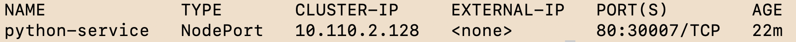
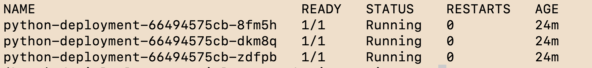
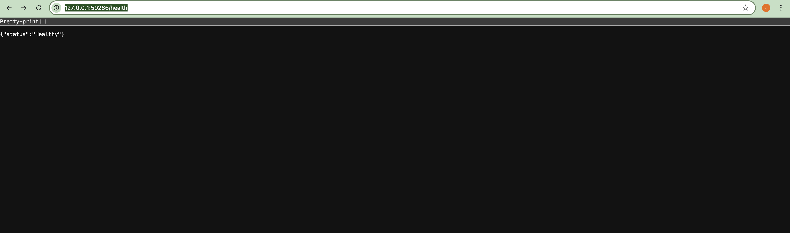
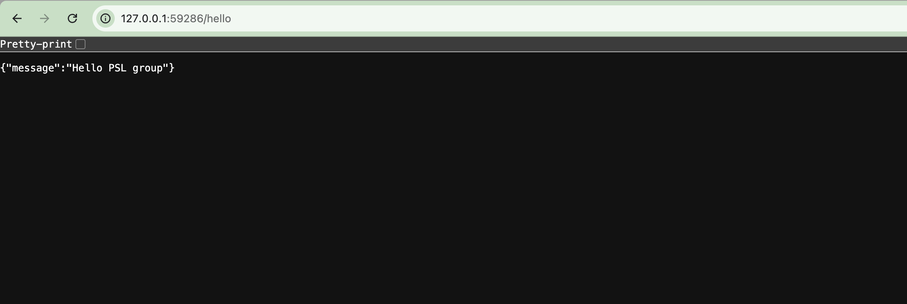

## 🚀 Application Overview

This project implements a simple RESTful API built with Python, designed to demonstrate
core DevOps practices such as containerization, automated testing, CI pipelines,
Security, Testing, and Observability (STO) best practices, and Kubernetes deployments.

The service exposes the following endpoints:

- `GET /hello`  
  Returns a simple greeting message to verify that the service is reachable.

- `GET /health`  
  Returns the current health status of the application. This endpoint is intentionally
  minimal and can be used for monitoring, liveness, and readiness checks. The `/health` endpoint returns a 
  static response, as the service has no external dependencies to validate (check connections with databases, 
  check cache with Redis, etc.).


The application is built using **FastAPI** and runs as a stateless service.
Automated tests are implemented using **pytest** to validate API behavior and service
health. The service does not rely on any external databases or third-party services,
keeping the focus on infrastructure, CI/CD, and deployment workflows.


## 🏃 Running the Service Locally

### Prerequisites
- Python 3.10 or higher
- pip

### Install dependencies
```bash
pip install -r requirements.txt
```

### Command to start the application
```bash
uvicorn app.main:app --host 0.0.0.0 --port 8000
```

## 🧪 Running Tests

Automated tests are integrated into the CI pipeline and are implemented using
**pytest** to validate the basic functionality of the API.

### Run tests locally
```bash
pytest
```

## ⚙️ CI/CD Workflow (GitHub Actions)

This project uses **GitHub Actions** to implement a Continuous Integration (CI)
pipeline that runs on every push to the main branch. Changes to documentation
files (such as the README) are excluded from triggering the workflow.

### CI Pipeline Steps
1. Checkout the repository
2. Install application dependencies
3. Run automated tests using **pytest**
4. Build the Docker image
5. Scan the container image using **Trivy (Aqua Security)** to identify
   potential vulnerabilities
6. Retag and push the Docker image to **Docker Hub**

This workflow ensures that code changes are automatically validated and that
only tested, scanned, and buildable artifacts are produced.
For more details, refer to the CI workflow definition:
[CI Workflow](.github/workflows/CI.yml)


### Continuous Deployment Notes

While a Continuous Deployment (CD) step could be implemented directly in
GitHub Actions using a simple `kubectl apply` approach, this project
intentionally focuses on CI.

For more advanced deployment strategies such as canary, rolling updates, or
blue-green deployments, a **GitOps-based approach using Argo CD** would be a
more appropriate and scalable solution.

There are also other platforms that can be used to implement the CD layer, such as:
- **FluxCD** – a pull-based GitOps alternative
- **Jenkins X** – a Kubernetes-native CI/CD platform

## ☸️ Deploying on Minikube

### Prerequisites
- Having docker installed locally, if you use a Mac or a Windows I recommend to use Docker Desktop, on the other hand if you are using linux I would prefer something more native.
- Install minikube or if you prefer the kubernetes from Docker Desktop its also a good option.

### Start Minikube
```bash
minikube start
```
### Steps to follow to deploy.
1. Create the yaml files (using vi), in this case you have the yaml files here in the github part, and you can just save it and use the folder k8s. They are on the following path: [Click to see kubernetes resources](k8s/)
2. After you create the resources (deployment and service you can use the following command):
```bash
kubectl apply -f k8s/
```
Or
```bash
kubectl apply -f deployment.yml
```
```bash
kubectl apply -f service.yml
```
3. You can do a quckly check of the services with
```bash
kubectl get pods
```
```bash
kubectl get services
```
4. Finally, you can use minikube to see your application:
```bash
minikube service "name of the service"
```

## ✅ Results

The following results demonstrate the successful  Service Accessibility, and Kubernetes deployment (minikube).


---

### Kubernetes Deployment on Minikube
The application is successfully deployed on a local Kubernetes cluster using
Minikube, with all pods running in a healthy state.





---

### Service Accessibility
The service is accessible through the Kubernetes service `minikube service` and responds correctly
to API requests.





